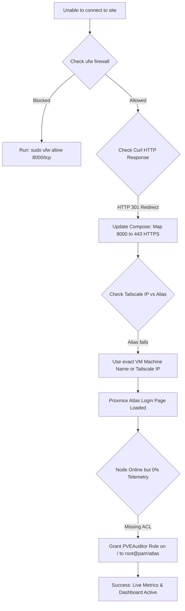

This document summarizes the deployment, configuration changes, network routing, and API permission configuration for **Proxmox Atlas** running within the local home lab environment.

---

## Architecture Overview

| Parameter | Configuration |
| :--- | :--- |
| **Physical Host** | `dell` / `dell-v1` (Dell OptiPlex Micro \| `192.168.1.220`) |
| **Target Guest** | VM 100 (`personal-projects` \| Ubuntu 24.04.5 LTS) |
| **Container Engine** | Docker Compose v2 |
| **Service Web Port** | Host Port `8000` (Mapped to Container SSL Port `443`) |
| **Remote Network** | Tailscale Mesh Network (MagicDNS / Dedicated Tailscale IP) |
| **Metric Ingestion** | Proxmox VE REST API via `PVEAuditor` Token |

---

## Completed Deployment Steps

### 1. Environment Preparation & Repository Setup
Cloned the official Proxmox Atlas repository into the VM user home directory and prepared the Docker runtime environment:

```bash
# Clone the official repository
git clone [https://github.com/Losstarot85/proxmox-atlas.git](https://github.com/Losstarot85/proxmox-atlas.git) ~/proxmox-atlas
cd ~/proxmox-atlas
```

:::tip[Docker Daemon Socket Permissions]
If encountering `permission denied while trying to connect to the Docker daemon socket`, apply group membership changes to the current terminal session without logging out:
```bash
newgrp docker
```
:::

---

### 2. Docker Compose Configuration Changes
Updated `docker-compose.yml` to route external traffic on host port **8000** directly to the Nginx reverse proxy's SSL engine running on container port **443**:

```yaml title="docker-compose.yml"
services:
  nginx:
    container_name: atlas-nginx
    # ...
    ports:
      - "8000:443"   # Maps host port 8000 to container HTTPS port 443

  backend:
    container_name: atlas-backend
    # ...

  prometheus:
    image: prom/prometheus:v3.4.1
    container_name: atlas-prometheus
    # ...
```

---

### 3. Firewall & Local Network Configuration
Opened TCP port `8000` on the VM's internal firewall:

```bash
sudo ufw allow 8000/tcp
sudo ufw reload
```

---

### 4. Container Build & Stack Launch
Built and launched the multi-container stack in detached mode:

```bash
docker compose up -d --build
```

#### Container Status Matrix
```text
NAME               SERVICE       STATUS                       PORTS
atlas-backend      backend       Up (healthy)                 
atlas-nginx        nginx         Up (unhealthy)               0.0.0.0:8000->443/tcp
atlas-prometheus   prometheus    Up                           9090/tcp
```

:::note[Understanding the "Unhealthy" Nginx Status]
The `atlas-nginx` container may report as `unhealthy` in `docker compose ps`. This is expected behavior. The container health check executes an internal `http://localhost/` query, which returns an `HTTP 301 Moved Permanently` response because Nginx strictly enforces HTTPS redirection. The web service itself is fully operational.
:::

---

### 5. Proxmox VE API Token & ACL Permissions
To allow Atlas to read node telemetry (CPU, RAM, Network, Storage), an API token was generated and assigned read permissions on the Proxmox cluster:

1. **Token Generation**:
   * Navigated to **Datacenter** $\rightarrow$ **Permissions** $\rightarrow$ **API Tokens** in the Proxmox VE UI (`192.168.1.220:8006`).
   * Created token `atlas` under user `root@pam`.

2. **ACL Permission Assignment**:
   * Navigated to **Datacenter** $\rightarrow$ **Permissions** (ACL Table).
   * Clicked **Add** $\rightarrow$ **API Token Permission**.
   * **Path**: `/` *(Root path)*
   * **Token**: `root@pam!atlas`
   * **Role**: `PVEAuditor`

:::tip[Alternative Quick Fix: Privilege Separation]
When creating an API token under `root@pam`, unchecking **Privilege Separation** allows the token to automatically inherit full read privileges without requiring a separate ACL entry.
:::

---

## Networking & Access Architecture

### Host vs. VM Identity Disambiguation

:::caution[Common Pitfall: Host vs. VM Name Resolution]
* **`dell` / `dell-v1`**: Refers to physical Hardware Node #2 (`192.168.1.220`).
* **`personal-projects`**: Refers to **VM 100** running inside Proxmox.

Navigating to `https://dell-v1:8000` fails because port `8000` is bound inside the guest VM OS (`personal-projects`), not directly on the Proxmox hypervisor.
:::

### Accessing the Dashboard

* **LAN Access**: `https://<VM-LOCAL-IP>:8000`
* **Tailscale Access**: `https://<VM-TAILSCALE-IP>:8000` or `https://personal-projects.<your-tailnet>.ts.net:8000`

*(Bypass self-signed SSL warnings in the browser by selecting **Advanced** $\rightarrow$ **Proceed**).*

---

## Workflow & Troubleshooting Log



---

## Status & Operational State

* [x] **Web Interface**: Accessible via Tailscale and Local LAN on port `8000` (`HTTPS`).
* [x] **Database & Prometheus**: Ingesting metrics from backend services.
* [x] **Node Telemetry**: Live CPU, RAM, Network, and Storage stats streaming from physical host `dell`.